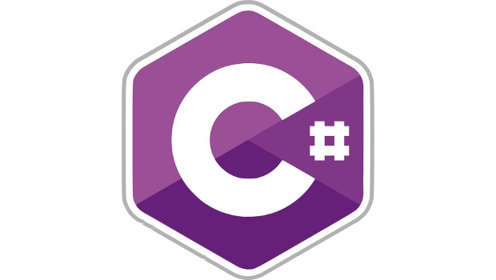

### Hi there 👋

      "If you wake up misrable in the morning, be thankfull that you have one" - somebody (with a few edits by Coderz75)

HELLO!

I'm Coderz75

Despite the plural z, I am one person

I go by the pronouns: He/Him

I currently know, c++, c#, Html, scratch, python, javascript (my first programming language), java - in the order of how much I know about them

                                                                                                                              

My github stats: 

I have been coding since I was 8 :)

I'm on replit, scratch, and discord!

Replit Acounts:

   https://replit.com/@nsyed_nha/ - main
  
   https://replit.com/@nuaymsyed - alternate
  
   https://replit.com/@nuaymsyed1 - school
  
Scratch: https://scratch.mit.edu/users/cwknuaym16920/

Discord: Nuaym #5039

Email: scienceboy75@gmail.com

### Featured projects:

Great! That's all folks
